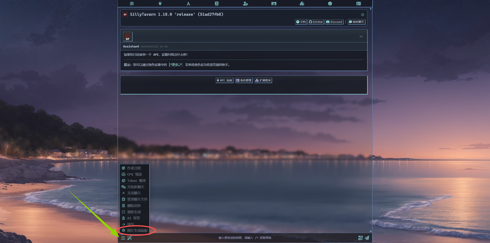

# ST-ComfyUI-WebUI-Helper

[English README](README.en.md) · [GitHub 仓库](https://github.com/Nianshui233/ST-ComfyUI-WebUI-Helper)


一个给 SillyTavern 用的聊天生图助手。

它可以把 RP 聊天内容交给 AI/LLM 单独分析，生成绘画提示词，再发送给 ComfyUI 或 Stable Diffusion WebUI 生图。主 RP 模型不用再一边写剧情一边硬塞绘图提示词，聊天正文更干净，生图提示词也更容易单独调试。

## 适合谁

- 你在 SillyTavern 里 RP，想根据当前剧情自动生图。
- 你使用 ComfyUI 或 Stable Diffusion WebUI。
- 你想把“写剧情”和“分析画面提示词”分开。
- 你想管理 LoRA、工作流、提示词预设、图片缓存和运行日志。
- 你希望能一键把一段剧情拆成多格连环画分别生图。

## 你会得到什么

| 功能 | 说明 |
| --- | --- |
| AI 生图 | 在聊天消息下方点击 `AI生图`，插件会先分析当前剧情，再自动生图。 |
| AI 提示词 | 只生成绘画提示词，打开后可编辑、保存、复制、再生图。 |
| 连环画模式 | 把当前剧情拆成 1 到 N 个分镜提示词，并按顺序逐格生成。 |
| ComfyUI / WebUI | 支持 ComfyUI API-format 工作流，也支持 Stable Diffusion WebUI。 |
| LoRA 管理 | 支持 ComfyUI LoRA 搜索、批量选择、权重批量应用、排序、触发词和注入自检。 |
| 工作流管理 | 支持工作流保存、导入导出、JSON 格式化、压缩、占位符转换和校验。 |
| AI/LLM 管理 | 默认使用 SillyTavern 当前 LLM，也可接 OpenAI-compatible 或 Anthropic API。 |
| 规则预设 | 可保存 Danbooru 标签规则、FLUX/自然语言规则等多套绘图分析规则。 |
| API Key 列表 | 支持多个自命名 Key，本地保存，列表只显示名称和遮罩尾号。 |
| 运行日志 | 集中显示连接、AI 调用、生图、错误和缓存操作，方便排查问题。 |

## 安装

### 1. 找到 SillyTavern 第三方扩展目录

插件需要放在这个目录里：

```text
SillyTavern/public/scripts/extensions/third-party/
```

Windows 示例：

```text
D:\AI\SillyTavern\public\scripts\extensions\third-party\
```

### 2. 克隆本仓库

```bash
cd SillyTavern/public/scripts/extensions/third-party
git clone https://github.com/Nianshui233/ST-ComfyUI-WebUI-Helper.git
```

克隆完成后，目录应该类似这样：

```text
SillyTavern/public/scripts/extensions/third-party/ST-ComfyUI-WebUI-Helper
```

### 3. 重启或刷新 SillyTavern

重启 SillyTavern，或刷新浏览器页面。然后在 SillyTavern 的扩展面板里启用：

```text
ComfyUI/WebUI Image Helper
```

## 插件入口在哪里

启用后，插件入口在 SillyTavern 聊天界面左下角菜单里，而不是顶部扩展图标里：



1. 点击聊天输入框左下角的菜单按钮，也就是截图里绿色箭头指向的位置。
2. 在弹出的菜单里找到 `图片生成面板`。
3. 点击 `图片生成面板`，就会打开本插件的设置面板。
4. 如果没看到这个入口，先刷新 SillyTavern 页面，再确认扩展已经启用。

入口名称来自插件注入的菜单项：`图片生成面板`。

## 第一次配置

### 最快跑通 ComfyUI

1. 打开插件面板。
2. 在 `基础设置` 里选择 `ComfyUI`。
3. 填写 ComfyUI 地址，常见是 `http://127.0.0.1:8188`。
4. 点击连接。
5. 选择 Checkpoint 或 UNet 模型。
6. 到 `生成参数` 设置宽高、步数、CFG、采样器等。
7. 在聊天消息下方点 `AI生图` 或 `AI提示词`。

### 最快跑通 WebUI

1. 在 `基础设置` 里选择 `WebUI`。
2. 填写 WebUI 地址，常见是 `http://127.0.0.1:7860`。
3. 点击连接并刷新模型列表。
4. 到 `生成参数` 设置 WebUI 参数。
5. 回到聊天里点击生图按钮。

### AI/LLM 管理怎么选

默认推荐先用：

```text
AI/LLM管理 -> 来源 -> SillyTavern 当前 LLM
```

这样最省事，不需要额外 API Key。等你确认插件流程正常后，再考虑接外部接口：

- OpenAI-compatible：适合 OpenAI、DeepSeek、硅基流动、OpenRouter、本地兼容服务等。
- Anthropic：适合原生 Claude API。
- 模型选择：支持自动或手动检测 `/models`，不支持模型列表的渠道可以手填。
- 思考模式：如果接口报错，先关闭思考模式，确认普通请求可用后再开启。

## 常用工作流

### 推荐路线：AI 生图

适合大多数 RP 场景。

```text
聊天消息 -> AI生图 -> LLM 分析画面 -> 自动调用 ComfyUI/WebUI -> 图片显示在消息下方
```

### 需要微调：AI 提示词

适合想先看提示词、手动改提示词的人。

```text
聊天消息 -> AI提示词 -> 打开“绘画提示词” -> 编辑/保存 -> 生图
```

### 多格剧情：连环画模式

1. 到 `基础设置` 的基础功能里开启 `启用连环画模式`。
2. 回到聊天消息下方，点击 `连环画`。
3. 插件会让 LLM 把当前剧情拆成多格分镜。
4. 你可以逐格生图，也可以点 `生成全部` 顺序生成。

## ComfyUI 工作流占位符

ComfyUI 工作流建议使用 API-format JSON，并把关键输入替换成占位符。

常用占位符：

```text
%prompt%            正向提示词
%negative_prompt%   反向提示词
%width%             生成宽度
%height%            生成高度
%model%             Checkpoint
%unet_model%        UNet 模型
%seed%              种子
%steps%             步数
%cfg%               CFG
%sampler%           采样器
%scheduler%         调度器
%init_image%        img2img 参考图
%denoise%           img2img 重绘幅度
```

工作流页面里有占位符按钮，可以直接插入，避免手敲出错。

## LoRA 使用提示

- ComfyUI LoRA 默认使用更稳的 `MODEL-only` 注入。
- 如果某个 LoRA 明确需要 CLIP/text encoder 权重，再切到 `MODEL+CLIP`。
- 建议给常用 LoRA 填触发词，插件会自动追加到最终正向提示词。
- 如果怀疑 LoRA 没生效，打开“保存最终工作流”，然后复制或导出最终工作流去 ComfyUI 里检查。
- 严格检查可以帮助发现注入失败、链路断开、采样器没接到 LoRA 后模型等问题。

## 常见问题

### 找不到模型怎么办？

先确认 ComfyUI/WebUI 已启动，再回插件里点击连接或刷新模型列表。ComfyUI 还要确认工作流里确实使用了 `%model%` 或 `%unet_model%`。

### 提示 `ComfyUI Checkpoint 模型未选择`

到 `基础设置` 里选择 Checkpoint，或者使用 UNet 工作流时选择 UNet 模型。

### 浏览器跨域、请求失败怎么办？

默认走 SillyTavern `/proxy`，通常不需要处理 CORS。只有你开启了直连模式，才需要 ComfyUI/WebUI 后端允许跨域。

### AI 提示词接口返回太短或 `finish_reason=length`

把 `AI/LLM管理` 里的响应长度调大，或精简绘图分析规则。Danbooru 规则通常比自然语言规则更容易被截断。

### 开启思考模式后报错

先关闭思考模式。不同渠道对推理参数支持不一样，普通请求能跑通后，再按渠道选择 OpenAI、Anthropic 或 DeepSeek 风格。

### 生成时图片块抖动或闪烁

新版已经尽量稳定连环画和图片块布局：生成时旧图会保留，进度条使用覆盖层，插件内部 DOM 变化也不会触发重复重渲染。如果仍然抖动，请带上运行日志和录屏反馈。

## 本地检查

本项目不需要构建。语法检查：

```bash
npm run check
```

## 目录结构

<details>
<summary>展开查看项目目录</summary>

```text
features/
  ai-prompt/                AI/LLM 绘图分析、规则预设、API Key、模型检测
  api-image/                API 生图渠道、Key 轮换、接口测试和状态摘要
  app/                      插件组装、运行时、生命周期与功能栈
  cache/                    生成图片缓存保存、列表与预览
  chat/                     聊天扫描、消息按钮与消息运行状态
  comfyui/                  ComfyUI 生成辅助、结果解析与资源读取
    lora/                   ComfyUI LoRA 列表、选择、触发词与工作流注入
  core/                     运行配置、连接会话、输入校验与对象缓存
  generation/               ComfyUI/WebUI 生成编排、按钮状态与 img2img
  logs/                     运行日志服务与日志面板控制
  panel/                    设置面板控制器、监听器、模式切换与参数 UI
  progress/                 生成进度、预览帧与执行状态
  resources/                模型、LoRA、Embedding 等资源加载服务
  settings/                 配置读写、备份导入导出与预设管理
  storyboard/               连环画分镜分析、保存、渲染与按钮动作
  webui/                    Stable Diffusion WebUI 生成与资源服务
  workflow/                 工作流管理、校验、调试、占位符转换
lib/
  browser/                  Blob URL 与用户脚本兼容辅助
  core/                     通用工具函数
  http/                     HTTP 请求封装与重试
  prompt/                   SD 提示词解析、合并与校验
  storage/                  图片缓存 IndexedDB 封装
ui/
  core/                     设备检测与 toast
  images/                   图片渲染、悬浮预览与对比模式
  panel/                    面板模板聚合、样式聚合、DOM 查询与拖拽位置
  presets/                  预设与本地选择列表通用 UI 工厂
  styles/                   按区域拆分的面板样式
  templates/                按标签页拆分的面板 HTML 模板
index.js                     SillyTavern 扩展入口
manifest.json                SillyTavern 扩展清单
style.css                    占位样式文件，主要样式由 JS 注入
```

</details>

## 许可

当前仓库尚未附带开源许可证。公开可见不等于自动授权再分发、商用或二次发布；如需这些用途，请先取得作者授权。
